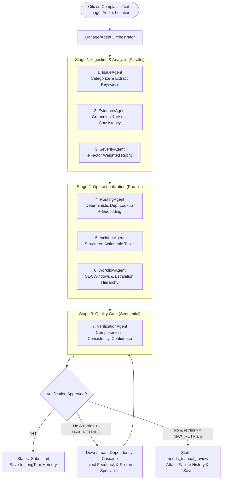

# CivicFlowAI - Smart Civic Issue Resolution Agent

Production-grade autonomous multi-agent AI system for civic complaint classification, evidence verification, severity assessment, department routing, incident compilation, SLA workflow planning, and quality gate verification.

---

## Architecture Overview

CivicFlowAI coordinates **7 Specialist Agents** across **3 Execution Stages** driven by a central **Manager Agent (Orchestrator)** with autonomous retry and downstream cascade capabilities:



### Specialist Agents

1. **IssueAgent** (`stage 1`): Classifies complaint into one of 11 civic categories (pothole, garbage, drainage, streetlights, etc.) and extracts key search entities.
2. **EvidenceAgent** (`stage 1`): Validates consistency between textual narrative and attached visual evidence, assigning a grounding score.
3. **SeverityAgent** (`stage 1`): Computes severity (Low/Medium/High/Critical) using a strict weighted rubric:
   - Safety risk: 40%
   - Public impact: 30%
   - Recurrence: 15%
   - Visual severity: 15%
4. **RoutingAgent** (`stage 2`): Deterministically queries department lookup tables and reverse geocoding to resolve jurisdiction.
5. **IncidentAgent** (`stage 2`): Synthesizes upstream specialist findings into a clean, actionable government ticket.
6. **WorkflowAgent** (`stage 2`): Establishes SLA follow-up timings (Critical=4h, High=24h, Medium=72h, Low=168h), escalation thresholds (2x), and escalation targets.
7. **VerificationAgent** (`stage 3`): Final quality gate verifying completeness, cross-agent consistency, and confidence thresholds (>= 0.70).

### Autonomous Manager Agent Retry Logic

- Fully autonomous — zero human-in-the-loop needed for self-correction.
- If verification fails:
  1. Identifies failed agents from `failed_agents`.
  2. Dynamically resolves downstream dependents via `Planner.get_downstream_dependents()` (e.g., re-running `IssueAgent` cascades to `SeverityAgent`, `RoutingAgent`, `IncidentAgent`, and `WorkflowAgent`).
  3. Re-runs specialists in topological order, injecting corrective feedback into prompts.
  4. Re-evaluates via `VerificationAgent`.
  5. Repeats up to `MAX_RETRIES` (default 2).
  6. Graceful degradation: If retries are exhausted, marks status as `needs_manual_review` with complete attempt history attached without crashing.
- **Audit Trail**: Every single attempt and retry is persisted to SQLite via `LongTermMemory.log_action()`.

---

## Directory Structure

```
agent/
├── app/
│   ├── __init__.py
│   ├── main.py                     # FastAPI application entrypoint
│   ├── api/
│   │   ├── __init__.py
│   │   ├── routes.py               # REST API endpoints
│   │   └── schemas.py              # Pydantic data schemas
│   ├── agent/
│   │   ├── __init__.py
│   │   ├── core_agent.py           # ManagerAgent orchestrator
│   │   ├── planner.py              # Execution plan & dependency graph
│   │   ├── executor.py             # Concurrent stage execution
│   │   └── specialists/
│   │       ├── __init__.py
│   │       ├── issue_agent.py
│   │       ├── evidence_agent.py
│   │       ├── severity_agent.py
│   │       ├── routing_agent.py
│   │       ├── incident_agent.py
│   │       ├── workflow_agent.py
│   │       └── verification_agent.py
│   ├── tools/
│   │   ├── __init__.py
│   │   ├── base_tool.py            # Abstract BaseTool
│   │   ├── department_lookup_tool.py # Deterministic routing table
│   │   ├── geocode_tool.py         # OpenStreetMap Nominatim reverse geocode
│   │   ├── calculator_tool.py      # AST-based safe arithmetic
│   │   ├── file_tool.py            # Base64 file decode & storage
│   │   └── search_tool.py          # Civic knowledge base search stub
│   ├── memory/
│   │   ├── __init__.py
│   │   ├── short_term.py           # In-memory blackboard
│   │   └── long_term.py            # SQLite tickets & audit log persistence
│   ├── llm/
│   │   ├── __init__.py
│   │   ├── openai_client.py        # Async OpenAI wrapper (vision, JSON, retry)
│   │   └── prompt_templates.py     # Strict agent prompts
│   └── config/
│       ├── __init__.py
│       └── settings.py             # Pydantic BaseSettings & .env loader
├── tests/
│   ├── __init__.py
│   ├── test_agent.py               # Mocked pipeline, retry cascade, max-retry tests
│   └── test_tools.py               # Tool tests & offline resilience
├── .env
├── .env.example
├── requirements.txt
├── requirements-dev.txt
├── Dockerfile
└── readme.md
```

---

## Getting Started

### 1. Installation

```bash
cd agent
python3 -m venv venv
source venv/bin/activate
pip install -r requirements.txt
pip install -r requirements-dev.txt
```

### 2. Configuration

Copy `.env.example` to `.env` and fill in either your OpenAI API Key or Google Gemini API Key:

```bash
cp .env.example .env
```

```ini
# Provider selection: "auto", "openai", or "gemini"
LLM_PROVIDER=auto

# OpenAI Configuration
OPENAI_API_KEY=sk-...
MODEL_NAME=gpt-4o-mini
VISION_MODEL_NAME=gpt-4o-mini

# Google Gemini Configuration
GEMINI_API_KEY=AIzaSy...
GEMINI_MODEL_NAME=gemini-1.5-flash

# System Configuration
MAX_RETRIES=2
CONFIDENCE_THRESHOLD=0.7
DATABASE_URL=sqlite:///./civic.db
LOG_LEVEL=INFO
```

### 3. Run the Service

```bash
uvicorn app.main:app --host 0.0.0.0 --port 8000 --reload
```

Interactive OpenAPI documentation is available at:
- Swagger UI: `http://localhost:8000/docs`
- ReDoc: `http://localhost:8000/redoc`

---

## REST API Endpoints

| Method | Path | Description |
|---|---|---|
| `POST` | `/api/v1/complaints` | Ingests a citizen complaint, orchestrates agents, returns resolved ticket |
| `GET` | `/api/v1/complaints` | Lists all stored complaints for the dashboard |
| `GET` | `/api/v1/complaints/{ticket_id}` | Retrieves a ticket by its ID |
| `GET` | `/api/v1/complaints/{ticket_id}/trace` | Retrieves full chronological audit trail of agent attempts & decisions |
| `POST` | `/api/v1/complaints/{ticket_id}/rerun` | Triggers manual verification and self-correction retry loop |
| `GET` | `/health` | System health check and active specialist agent list |

---

## Sample Request & Response

### Submit Complaint

```bash
curl -X POST "http://localhost:8000/api/v1/complaints" \
  -H "Content-Type: application/json" \
  -d '{
    "text": "Deep hazardous pothole on 100 Feet Road right outside Indiranagar Metro Station. Two-wheelers are swerving into oncoming traffic to avoid it.",
    "location": {
      "lat": 12.9783,
      "lng": 77.6408
    }
  }'
```

### Sample Output Ticket

```json
{
  "ticket_id": "TICK-A4F91B2C",
  "issue_type": "pothole",
  "description": "Hazardous road pothole requiring rapid asphalt resurfacing on arterial road near metro station.",
  "severity": "High",
  "department": "Roads & Infrastructure Department",
  "location": {
    "lat": 12.9783,
    "lng": 77.6408
  },
  "status": "Submitted",
  "created_at": "2026-09-20T12:00:00.000000",
  "verification": {
    "approved": true,
    "failed_agents": [],
    "feedback": {},
    "reasoning": "Complete, consistent, and exceeds confidence thresholds."
  },
  "retry_count": 0,
  "audit_trail": [ ... ]
}
```

---

## Running Tests

```bash
cd agent
pytest -v
```

Tests validate:
- Department lookup tool accuracy across all issue categories and unknown fallback.
- Geocoding graceful offline fallback.
- Safe AST calculator evaluation.
- Pipeline Happy Path (all agents pass, ticket approved as `Submitted`).
- Autonomous Retry & Downstream Cascade (severity fails initially, manager re-runs severity + downstream dependents, ticket approved on retry).
- Max-Retries Exhaustion (fails 2x, gracefully sets `needs_manual_review` without crashing).

---

## Docker Deployment

```bash
cd agent
docker build -t civicflow-agent .
docker run -p 8000:8000 --env-file .env civicflow-agent
```
