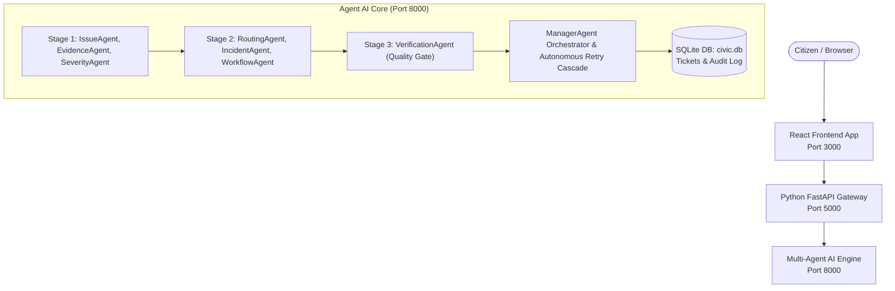

# CivicFlowAI - Autonomous Multi-Agent Smart Civic Issue Resolution Platform

CivicFlowAI is an intelligent, end-to-end civic complaint resolution platform built for hackathons and production environments. It features a React frontend, Python FastAPI API gateway, an autonomous 7-agent AI core with self-correction, and full Docker Compose containerization.

---

## System Architecture



---

## Project Directory Map

```
CivicFlowAI/
├── agent/                       # Multi-Agent AI Core (FastAPI on Port 8000)
│   ├── app/
│   │   ├── agent/               # ManagerAgent, Planner, Executor, 7 Specialists
│   │   ├── api/                 # Pydantic schemas & internal routes
│   │   ├── config/              # pydantic-settings & dotenv settings
│   │   ├── llm/                 # OpenAI & Google Gemini dual-provider client
│   │   ├── memory/              # Short-term blackboard & Long-term SQLite
│   │   └── tools/               # Department lookup, Geocode, Calculator, File tools
│   ├── tests/                   # Pytest suite
│   ├── .env                     # Agent environment settings
│   ├── Dockerfile               # Agent container manifest
│   └── test_manual.py           # Interactive CLI manual complaint runner
├── backend/                     # API Gateway Service (FastAPI on Port 5000)
│   ├── app/                     # Gateway routes proxying to agent
│   ├── Dockerfile               # Backend container manifest
│   └── requirements.txt         # Gateway dependencies
├── frontend/                    # React 18 + Vite Web App (Nginx on Port 3000)
│   ├── src/                     # App.jsx, index.css, api.js
│   ├── Dockerfile               # Multi-stage Vite + Nginx container manifest
│   └── package.json             # React & Lucide icons
├── docker-compose.yml           # Unified 3-container orchestration
└── readme.md                    # System documentation
```

---

## Quickstart Guide

### Option 1: Run via Docker Compose (Recommended)

Make sure you have specified your API key in `agent/.env` (Gemini or OpenAI).

```bash
docker-compose up --build
```

Access services:
- **React Frontend UI**: `http://localhost:3000`
- **Backend API Gateway**: `http://localhost:5001/docs`
- **Agent Core System**: `http://localhost:8000/docs`

---

### Option 2: Run Services Locally (Development Mode)

#### 1. Start Agent Service (Port 8000)
```bash
cd agent
python -m uvicorn app.main:app --port 8000 --reload
```

#### 2. Start Backend Gateway (Port 5001)
```bash
cd backend
python -m uvicorn app.main:app --port 5001 --reload
```

#### 3. Start React Frontend (Port 3000)
```bash
cd frontend
npm install
npm run dev
```

Open `http://localhost:3000` in your browser.
